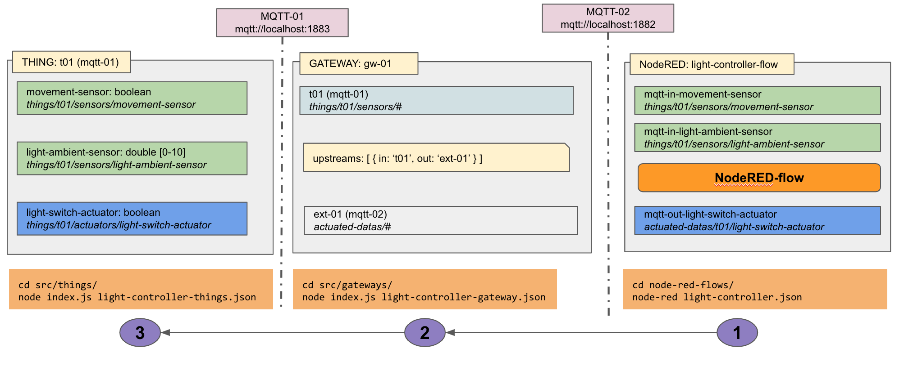

# Test and Simulation

Test and Simulation enabler

## Setup

```
cd test_and_simulation/
npm install
npm run build
```

## Usage

### Start application
Create `.env` file: `cp env.example .env`
Update the `host` and `port` then start the application.

```
npm run start
```

Access to the Test and Simulation Enabler dashboard at: `http://[YOUR_IP_ADDRESS]:31057`

### Data Generator
Generate data (sensors and actuators) and store the data into a database
Update the configuration `data-01.json` file
```
cd src/data-generators/
node index.js test data-01.json
```

### Simulate Gateway(s)
Simulate gateway(s) with the input configuration file: `gw-config.json`
```
cd src/gateways/
node index.js gw-config.json
```

### Simulate Thing(s)
Simulate thing(s) with the input configuration file: `thing-config.json`
A THING can contain list of sensor(s) and actuator(s)
```
cd src/things/
node index.js test thing-config.json
```

## Use Cases

### Light Controller



## External Components
Some external services may required such as: `mongodb-server`, `mqtt-broker`, `node-red`
The services can be provided as docker containers.

### Node-RED

```shell
sudo npm install -g --unsafe-perm node-red
```
Additional packets: `node-red-mongodb`, `node-red-contrib-web-worldmap`, `node-red-dashboard`

### MongoDB server

Start a Mongodb server
```shell
docker run --name mongo-server -d -p 27017:27017 mongo
```

### MQTT broker server

Start a MQTT broker server
```shell
docker run --name mqtt-broker -d -p 1882:1883 luongnv89/mosquitto-mqtt-broker
```

### MQTT client interface

Start a MQTT client interface
```shell
docker run --rm -it luongnv89/mosquitto-cli /bin/sh
```

Subscribe a channel
```shell
mosquitto_sub --host 192.168.0.11 --port 1882 -t "#"
```

Publish a message
```shell
mosquitto_pub --host 192.168.0.11 --port 1882 -t "ext-01-sub-topic" -m "Hello World"
```

### docker useful commands

```shell
docker ps
docker ps -a
docker start container-name
docker stop container-name
docker attach container-name
```

## Discussion
- In the configuration of gateways and things, if the thing with id `t01` scales `2` times, then the configuration of the thing `t01` in the gateway should scale `2` times as well, so that they will automatically adapt
- In the configuration of gateway, the upstreams section, the value of `out` is an array because the upstreams can be multiple different service
- The gateway cannot be scaled, because the id does not effect to the functionality of the gateway -> other way to say, if two gateways are only difficiated by their ids, their functionalities are exactly the same.
- The external component in the gateway is not scalable (same explaination with the gateway)