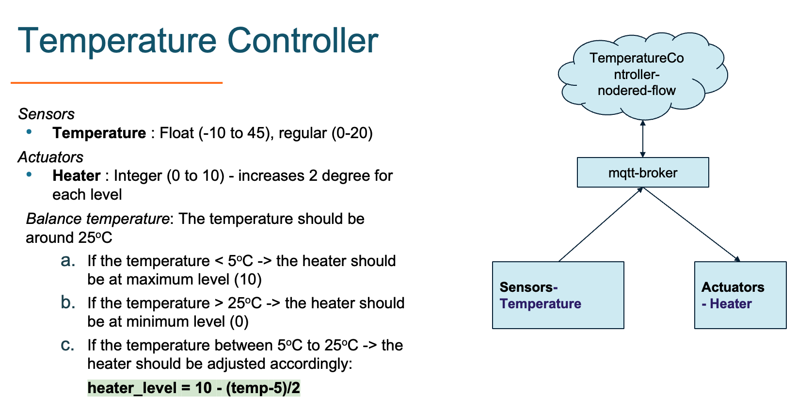

# Test and Simulation

Test and Simulation

## Use docker image

```
docker run --name my-tas -d -p 1883:1883 -p 1880:1880 -p 3004:3004 ghcr.io/montimage/tas:v1.0.2
```

Then access to the tool at the address: `http://[your_ip_address]:3004`

A MQTT broker server at the address: `[your_ip_address]:1883`,
A nodered server at the address: `http://[your_ip_address]:1880`, and the nodered dashboard at the address: `http://[your_ip_address]:1880/ui`

## Install from source code

```
cd tas/
npm install
```

### Usage

#### Start application

_Customize dashboard address_

Create `.env` file: `cp env.example .env`
Update the `host` and `port` then start the application.

_Start the application_

```
npm run start
```
Access to the Test and Simulation Enabler dashboard at: `http://your_ip:3004`

## Connect to a MongoDB Server

After starting the application, the Data Storage need to be configured to connect with a MongoDB server

- Open the browser and go to the application at: http://your_ip:3004
- Go to the Tab `Data Storage` and update the parameter for connecting to a MongoDB Server

A MongoDB Server can be set up easily with docker:
```
docker run --name mongo-server -d -p 27017:27017 mongo
```

## DEVELOPMENT

### Create docker image for multiple platform
Source: https://www.docker.com/blog/multi-arch-images/
- Enable `buildx`:
- Create new build engine:
```
docker buildx create --name mybuilder
docker buildx use mybuilder
docker buildx inspect --bootstrap
```
- Build a new image for multiple platform
```
docker buildx build --platform linux/amd64,linux/arm64 -t image_name:tag --push .
```

## Use Cases

### Temperature Controller

By default, there is a simple example of Temperature Controller
The simple IoT network is figured in the following photo:



The Topology can be accessed on the GUI of TaS.
The noderedflow is the default flow when open the nodered application

# License
Montimage