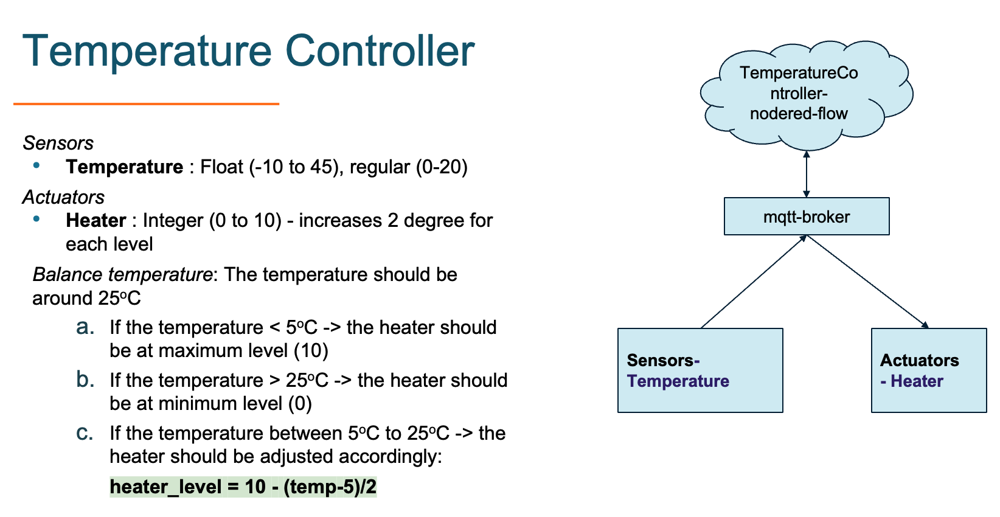

# Test and Simulation

Test and Simulation

## Quick start (composed deployment)

Since issue #45 TaS ships as **three separate images** — the application, the
MQTT broker and the Node-RED flow editor — wired together by a composition.
Each service is its own container with its own health check, so it can be
restarted, upgraded, scaled and watched independently.

The whole quick start is one command:

```
docker compose up -d
```

Then:

| Service | Address                         | What it is                                                                                       |
| ------- | ------------------------------- | ------------------------------------------------------------------------------------------------ |
| app     | `http://127.0.0.1:3004`         | The TaS dashboard and API.                                                                       |
| broker  | `127.0.0.1:1883`                | An authenticated MQTT broker (account `tas`, password `change-me-broker` until you override it). |
| nodered | `http://127.0.0.1:1880` (`/ui`) | The flow editor with the Temperature Controller demo preloaded.                                  |

Health status of every service: `docker compose ps` — each long-running
service declares a health check (`healthy` means its readiness probe answers).
Restart any one service without touching the others:

```
docker compose restart app      # or broker, or nodered
```

### Provisioning real credentials

The quick-start stack is convenient, not hardened: the broker password file is
seeded into a volume on first start with development credentials, and the
application starts without a session secret (sessions then end at every
restart). For anything beyond a throwaway local stack, create a `.env` next to
`docker-compose.yml` (compose reads it automatically; it is git-ignored and
never baked into any image):

```
# Application credential and session secret (see Security below)
SESSION_SECRET=$(openssl rand -hex 32)
AUTH_ADMIN_USERNAME=admin
AUTH_ADMIN_PASSWORD_HASH=scrypt$...   # see "Provisioning the administrator credential"

# Broker account seeded on first start (delete the broker-passwd volume to re-seed)
MOSQUITTO_USERNAME=tas
MOSQUITTO_PASSWORD=change-me-broker
```

> **Security note:** the TaS API requires an authenticated session. A
> production deployment must provision an administrator credential and a
> session secret — without them the dashboard cannot log in (no credential)
> or every restart signs everyone out (no secret). See the
> [Security](#security) section before deploying.

### Running only the application container

The application image can run standalone — point its clients at any reachable
broker via `TAS_MQTT_HOST` / `TAS_MQTT_PORT`. Container tags published before
v2.0.0 predate authentication (see the [changelog](CHANGELOG.md)); use a tag
of v2.0.0 or newer, or build the image from this checkout:

```
docker build -t tas:local .
TAS_IMAGE=tas:local

# One-time administrator credential. The password is hashed where you type it;
# only the scrypt hash reaches the container's environment.
ADMIN_HASH="$(docker run --rm "$TAS_IMAGE" \
  node -e "console.log(require('./src/server/auth/passwords').hashPassword(process.argv[1]))" \
  'change-me-now')"

docker run --name my-tas -d \
  -p 127.0.0.1:3004:3004 \
  -e SESSION_SECRET="$(openssl rand -hex 32)" \
  -e AUTH_ADMIN_PASSWORD_HASH="$ADMIN_HASH" \
  -e TAS_MQTT_HOST="host.containers.internal" \
  "$TAS_IMAGE"
```

If you need other hosts on a **trusted private network** to reach the service, replace
`127.0.0.1` with the machine's private interface address. Do not publish these ports to
`0.0.0.0` or to the public internet, and keep in mind the Node-RED
editor has no credential of its own. The MQTT broker
does require authentication on its published port — see the next section.

## Architecture of the composition

```
┌─────────── compose network ────────────┐
│  ┌────────┐   1883 (auth)   ┌────────┐ │
│  │ broker │◄────publish─────│   app  │ │◄── 127.0.0.1:3004
│  └────────┘                 └────────┘ │
│       ▲ 1884 anonymous            ▲    │
│       └────────────┐              │    │
│               ┌────────┐          │    │
│     broker-init (one-shot)  │    │    │
│               └────────┘   ┌────────┐ │◄── 127.0.0.1:1880
│                            │nodered │ │
│                            └────────┘ │
└────────────────────────────────────────┘
```

- **broker** runs [`deploy/compose/broker.conf`](deploy/compose/broker.conf):
  port 1883 is authenticated and the only listener published to the host;
  port 1884 is anonymous but exists only inside the compose network. A
  one-shot `broker-init` service seeds the password file into a volume before
  the broker starts.
- **app** is built from this repository's `Dockerfile`: TaS and its own
  dependencies only — no broker, no editor, no supervisor. It reports
  readiness on `GET /api/health`, which is both the image's `HEALTHCHECK` and
  the health check the composition declares.
- **nodered** mounts the demo flow, whose broker address resolves through the
  same `TAS_MQTT_HOST`/`TAS_MQTT_PORT` environment variables the app uses
  (core simulation clients resolve their endpoints through them too — see
  `src/core/utils/mqtt-endpoint.js`).

Every service carries `restart: unless-stopped` and waits for its
dependencies' health checks (`depends_on` + `condition`) so a cold start comes
up in order while restarts stay independent.

### Migrating from the single-container deployment

Earlier releases supervised mosquitto, Node-RED and TaS under `supervisord`
inside one image. That image is retired; the upgrade is:

1. Note your broker password file (it was mounted at `/run/mosquitto/passwd`)
   and your `SESSION_SECRET` / `AUTH_ADMIN_PASSWORD_HASH` values — they carry
   over unchanged.
2. Stop and remove the old container: `docker stop my-tas && docker rm my-tas`.
3. Put the credentials in `.env` as shown above, using your existing values
   (`MOSQUITTO_USERNAME`/`MOSQUITTO_PASSWORD` replace the old password-file
   entry).
4. `docker compose up -d`. Data written by simulations lives in MongoDB,
   which is external to all three services and unaffected; retained MQTT
   messages start empty unless you migrate `/var/lib/mosquitto` from the old
   container into the `broker-data` volume.

## MQTT broker access policy

Two policies are committed, both stated in the repository rather than
inherited from distribution defaults (issue #46):

| Deployment                                               | Config file                                                | 1883                                 | Internal listener                                                  |
| -------------------------------------------------------- | ---------------------------------------------------------- | ------------------------------------ | ------------------------------------------------------------------ |
| Composition ([`docker-compose.yml`](docker-compose.yml)) | [`deploy/compose/broker.conf`](deploy/compose/broker.conf) | Authenticated, published to the host | `1884` anonymous, bound to the compose network — **not** published |
| Standalone broker container                              | [`mosquitto.conf`](mosquitto.conf)                         | Authenticated                        | `1884` anonymous, loopback inside the broker container             |

External MQTT clients (sensors, gateways, test harnesses outside the
composition) connect to port 1883 with the broker username and password.
Services inside the composition use the anonymous internal listener on port
1884 without any credential — the bundled simulation assets and the demo
Node-RED flow resolve it through `TAS_MQTT_HOST=broker`, `TAS_MQTT_PORT=1884`.

### Broker credentials

The password file is **never committed** to this repository or baked into an
image — it is supplied through configuration like every other credential (the
filename `mosquitto.passwd` is excluded by both `.gitignore` and
`.dockerignore`). In the composition it is seeded into the `broker-passwd`
volume on first start from `MOSQUITTO_USERNAME`/`MOSQUITTO_PASSWORD`; the file
holds scrypt hashes, never plaintext. Delete the volume to re-seed:

```
docker compose down && docker volume rm tas_broker-passwd && docker compose up -d
```

For a standalone broker, generate a password file with `mosquitto_passwd` and
mount it at `/run/mosquitto/passwd`. Without a password file the broker exits
and reports the missing credential source loudly rather than coming up
half-open. Retained messages survive container restarts (`persistence true`,
stored in the `broker-data` volume).

## Install from source code

The runtime is pinned to the current Node LTS (**24**): `.nvmrc` carries the
version for nvm/fnm/mise to select automatically, and both manifests declare it
under `engines`, so installing on anything older prints a clear EBADENGINE
warning (`nvm install` in the repo root picks the pinned version up).

```
cd tas/
npm install
```

### Build the dashboard

The web dashboard under `src/client/` is built with Vite and emitted to
`src/public/`, which the server serves at `/`. The compiled bundle is **not**
committed (see issue #42) — build it after installing dependencies, and
whenever the client source changes:

```
cd src/client
npm install
npm run build      # emits to ../public (i.e. src/public)
```

For local development with hot reloading, use `npm run dev` instead of
`npm run build`. The published Docker image builds the dashboard automatically
during `docker build`, so no manual step is needed there.

### Usage

#### Start application

_Customize dashboard address_

Create `.env` file: `cp env.example .env`
Update the `host` and `port` then start the application.

> **Configuration and credentials**
> The `.env` file is git-ignored and **never tracked** in the repository or
> baked into the published Docker image (it is listed in `.dockerignore`).
> It is the documented place for machine-specific values and any credentials
> (MongoDB URIs, MQTT passwords, API keys). Use `cp env.example .env` to create
> it locally, and never commit a `.env` file. Without a local `.env`, the
> server starts with the safe defaults from `env.example`.

_Provision an administrator credential_

Every API endpoint requires an authenticated session, so a fresh install
cannot log in until the server has its administrator credential and session
secret. Generate the password hash from this checkout and put both values in
`.env`:

```
node -e "console.log(require('./src/server/auth/passwords').hashPassword(process.argv[1]))" 'your-password-here'
# scrypt$16384$8$1$<salt>$<hash>
```

```
AUTH_ADMIN_USERNAME=admin
AUTH_ADMIN_PASSWORD_HASH=scrypt$16384$8$1$...   # output of the command above
```

Generate the session secret with `openssl rand -hex 32` and paste the value it
prints on the `SESSION_SECRET` line (`.env` values are read literally, so do not
put the `$(openssl …)` command itself there):

```
SESSION_SECRET=64-hex-characters-printed-by-openssl
```

See [Provisioning the administrator credential](#provisioning-the-administrator-credential)
in the Security section for what these values mean and for alternatives.

_Start the application_

```
npm run start
```

Access to the Test and Simulation Enabler dashboard at: `http://your_ip:3004`
Log in with the administrator username and password you provisioned above.

## Connect to a MongoDB Server

After starting the application, the Data Storage need to be configured to connect with a MongoDB server

- Open the browser and go to the application at: http://your_ip:3004
- Go to the Tab `Data Storage` and update the parameter for connecting to a MongoDB Server

A MongoDB Server can be set up easily with docker:

```
docker run --name mongo-server -d -p 27017:27017 mongo
```

## API responses

Every endpoint answers with the HTTP status code that describes the outcome, so
a client, a reverse proxy or a monitor can tell a served request from a failed
one without parsing the body.

| Status | When                                                                                                                                     |
| ------ | ---------------------------------------------------------------------------------------------------------------------------------------- |
| `2xx`  | The request was served.                                                                                                                  |
| `400`  | The request was malformed — a field of the wrong type, a name that cannot derive a safe file path, a document the database refused.      |
| `401`  | The request carries no valid session. Log in at `POST /api/auth/login`; a session that has expired or been logged out reads the same.    |
| `403`  | The request came from an origin that is not in `CORS_ALLOWED_ORIGINS`, or a state-changing request did not carry a valid `X-CSRF-Token`. |
| `404`  | The addressed model, data recorder, log, data set, event, report, test case, test campaign or API path does not exist.                   |
| `409`  | The request conflicts with the current state — starting a simulation or a data recorder that is already running.                         |
| `413`  | The body is larger than `BODY_LIMIT`.                                                                                                    |
| `415`  | The request carries a content encoding the server cannot read.                                                                           |
| `429`  | The client is over `RATE_LIMIT_MAX` for the current window.                                                                              |
| `5xx`  | The server failed (`500`), or a dependency such as the database is not reachable (`503`).                                                |

Every failure carries the same JSON body, produced by one central handler
(`src/server/middleware/errors.js`):

```json
{
  "error": "Validation failed",
  "details": [
    {
      "location": "body",
      "field": "model.name",
      "message": "\"model.name\" must be a string",
      "type": "string.base"
    }
  ]
}
```

`error` is a message chosen for the caller and safe to display; `details` is
present only for a validation failure, where it names each refused field. A
response body never carries a stack trace, a server filesystem path or the raw
underlying error — that detail is written to the server log instead, where it
stays available for diagnosis.

## API specification

The complete API — every endpoint, its parameters, request bodies and
responses, with the exact constraints the server validates — is published as an
OpenAPI 3.0 document:

- **Served live:** `GET /openapi.json` (no session required).
- **Committed:** [`openapi.json`](openapi.json) at the repository root,
  regenerated with `npm run spec`.

The document is generated from the same mounted routers and validation schemas
the server enforces (`src/server/openapi/`), so it cannot drift from the
implementation: an endpoint added to a router appears in the next generated
specification with exactly what its schema accepts.

## Structured logs and correlation ids

Log records are one machine-parseable JSON object per line, carrying `timestamp`,
`level`, `label`, `message` and any structured fields. Two correlation
identifiers tie records together (issue #47):

- **Requests:** every request is assigned an id (an incoming trusted
  `X-Request-Id` header is honoured), echoed back in the `X-Request-Id`
  response header, and attached to the access record written when the response
  finishes plus any failure record the central handler writes.
- **Runs:** a simulation, data recorder or test campaign writes all of its own
  lines into its log file under its run id as `correlationId`.

Verbosity is configurable without a code change via `LOG_LEVEL`
(`error` | `warn` | `info` | `debug`, default `info`; see `env.example`). Values
reached through sensitive keys — passwords, tokens, secrets — are redacted
before anything is written.

## DEVELOPMENT

### Run the E2E security regression suite

The suite starts a real server instance (and, for the container checks, builds
the image) and drives it over HTTP:

```
# HTTP assertions: path containment, name sanitisation, CORS, rate/body limits,
# and legitimate topology flows. Run serialised - each file spawns its own real
# instance against the same storage root.
node --test-concurrency=1 --test test/e2e/security-suite.test.js test/e2e/limits.test.js

# Container assertion: the built image must run its processes as a non-root user
docker build -t montimage/tas:e2e .
TAS_IMAGE=montimage/tas:e2e node --test test/e2e/container-nonroot.test.js
```

These assertions require the security fixes (path containment, CORS allowlist,
body-size and rate limits, non-root image) to be present, and are enforced in
CI on every push to `master` and every pull request via
`.github/workflows/e2e-security.yml`, which also runs `npm run lint`. Updates
for both dependency manifests (the server root and the dashboard client) are
proposed weekly by Dependabot via `.github/dependabot.yml`.

`npm test` runs everything under `test/`, including the end-to-end files, and
is serialised with the same `--test-concurrency=1` for the same reason. Some
end-to-end assertions drive routes that need a database; with none reachable
they wait out the connect timeout, so a full local run takes roughly half a
minute even though the assertions themselves are fast.

### Run the simulation lifecycle gate

`test/e2e/simulation-lifecycle.test.js` is the Phase 2 milestone gate (issue
#21): it starts simulations through the API and proves concurrent per-run log
isolation, statistics behaviour, prompt failure of saves against unwritable
locations, data-storage save refusal with survival of the working
configuration, error detail in run logs, and stable open-handle counts across
start-stop cycles.

Most of it needs nothing but the application itself. Three tests additionally
need an MQTT broker and/or MongoDB and probe for them at startup, skipping
with an explicit reason when absent — point them at local services with:

```
TAS_E2E_MQTT_HOST=127.0.0.1 TAS_E2E_MQTT_PORT=1883 \
TAS_E2E_MONGO_HOST=127.0.0.1 TAS_E2E_MONGO_PORT=27017 \
node --test test/e2e/simulation-lifecycle.test.js
```

### Run the modernised-stack gate

`test/e2e/modernised-workflow.test.js` is the Phase 4 milestone gate (issue
#33): it drives the complete product workflow against the migrated server —
define a topology through the API, record real data with a data recorder,
replay the recorded dataset in a simulation, and read the generated report's
score — and asserts what else the migration had to preserve: documents written
by the pre-migration version stay readable, restarting mid-simulation leaves
`/api/simulation/status` reporting the truth, and two concurrent edits of one
topology land as one complete record instead of discarding each other.

Three supporting suites complete the gate outside the e2e file:
`test/scoring-determinism.test.js` pins report scores on a fixed input dataset
to the pre-migration algorithm and hand-derived literals;
`test/throughput-baseline.test.js` asserts scoring still meets or exceeds the
pre-migration baseline and event writes keep their batching shape; and
`test/dependency-audit.test.js` re-runs CI's advisory gate over the server
manifest. As with the lifecycle gate, service-dependent tests probe for MQTT
and MongoDB at startup and skip with an explicit reason when absent:

```
TAS_E2E_MQTT_HOST=127.0.0.1 TAS_E2E_MQTT_PORT=1883 \
TAS_E2E_MONGO_HOST=127.0.0.1 TAS_E2E_MONGO_PORT=27017 \
node --test test/e2e/modernised-workflow.test.js
```

### Create docker image for multiple platform

Source: https://www.docker.com/blog/multi-arch-images/

- Enable `buildx`:
- Create new build engine:

```
docker buildx create --name mybuilder
docker buildx use mybuilder
docker buildx inspect --bootstrap
```

- Build a new image for multiple platform

```
docker buildx build --platform linux/amd64,linux/arm64 -t image_name:tag --push .
```

## Use Cases

### Temperature Controller

By default, there is a simple example of Temperature Controller
The simple IoT network is figured in the following photo:



The Topology can be accessed on the GUI of TaS.
The noderedflow is the default flow when open the nodered application

# Security

## Authentication

Every API endpoint requires an authenticated session. TaS is single-tenant:
there is one administrator account, and it is provisioned from configuration
rather than from anything in this repository, so a checkout never carries a
working credential and two deployments never share one.

### Provisioning the administrator credential

The preferred form is a pre-computed hash, so the plaintext only ever exists on
the machine where it was generated:

```
node -e "console.log(require('./src/server/auth/passwords').hashPassword(process.argv[1]))" 'your-password-here'
# scrypt$16384$8$1$<salt>$<hash>
```

Put the result in `AUTH_ADMIN_PASSWORD_HASH`:

```
AUTH_ADMIN_USERNAME=admin
AUTH_ADMIN_PASSWORD_HASH=scrypt$16384$8$1$...
```

For a first start, `AUTH_ADMIN_PASSWORD` accepts a plaintext instead. It is
hashed once at startup and the plaintext is discarded immediately — it is erased
from the configuration object as it is hashed, so it is never stored, never
logged and never returned — but it does sit in the environment of the running
process, which is why the hashed form is preferred.

With neither set the server still starts, says so loudly on stderr, and refuses
every API request: an appliance that cannot be configured is safer than one that
opens itself up.

### What answers without a session

The allowlist is explicit, lives in one place (`src/server/middleware/auth.js`)
and holds exactly three endpoints:

| Endpoint                | Why it is public                                                                                                                                 |
| ----------------------- | ------------------------------------------------------------------------------------------------------------------------------------------------ |
| `GET /api/health`       | Liveness probe for an orchestrator or monitor. Reports `{"status":"ok"}` and deliberately nothing else — no uptime, version or dependency state. |
| `POST /api/auth/login`  | The endpoint that issues a session.                                                                                                              |
| `GET /api/auth/session` | Lets the dashboard ask whether it is logged in. Answers `200` either way, so a cold start is not a 401 storm.                                    |

A genuine CORS **preflight** — an `OPTIONS` request carrying both an `Origin`
and an `Access-Control-Request-Method` header — is also answered without a
session, because a preflight carries no credentials by definition. A _bare_
`OPTIONS` is not exempt: it is refused with `401` like anything else, so an
anonymous caller cannot read an `Allow` header off every path and map which
endpoints exist and which methods they accept.

`POST /api/auth/logout` is **not** on the list: logging out acts on a session,
so it needs one.

The static dashboard bundle and the single-page app shell stay public as well.
That is deliberate — the login page is part of that bundle, so gating it would
leave a browser with nothing to log in with. The bundle contains no operational
data: every value the dashboard displays comes from the API, which is closed.

### Sessions

`POST /api/auth/login` with `{"username": "...", "password": "..."}` answers
`200` and sets two cookies:

- `tas.sid` — an opaque, signed, `HttpOnly`, `SameSite=Lax` session identifier.
  The session itself lives server-side, which is what makes it revocable.
- `tas.csrf` — the CSRF token for that session. Readable by script on purpose
  (see below).

Sessions expire two ways. `SESSION_TTL_MS` (default 1 hour) is an _idle_
timeout that slides forward on every request, so working in the dashboard never
logs you out mid-task; `SESSION_ABSOLUTE_TTL_MS` (default 12 hours) is a hard
cap that does not slide. `POST /api/auth/logout` invalidates a session
immediately, and replaying its cookie afterwards answers `401`. Sessions are
held in the process, so a restart ends all of them.

The session table also has a hard size cap, `SESSION_MAX_RECORDS` (default
1000): when it is full the least recently seen record is evicted. Expiry alone
is not a bound — nothing stops records being minted faster than they age out —
and a single-tenant appliance never has a thousand live operator sessions, so
the cap only ever bites on runaway traffic.

### Cross-site request forgery

Every state-changing request (`POST`, `DELETE`) must carry the session's token
in an `X-CSRF-Token` header:

```
curl -X POST http://127.0.0.1:3004/api/models \
  -H 'Content-Type: application/json' \
  -H "X-CSRF-Token: $(...value of the tas.csrf cookie...)" \
  -b cookies.txt -d '{"model": {"name": "demo", "devices": []}}'
```

A browser attaches the session cookie to any request that reaches this origin,
including one an unrelated page caused, so the cookie alone cannot be what
authorises a write. A cross-site page can cause the cookie to be _sent_ but the
same-origin policy stops it from _reading_ it, so it can never produce the
header. `POST /api/auth/login` is exempt, because it is what issues the token.

Four endpoints change state over `GET` and therefore need the header as well:

- `GET /api/devops/start` and `GET /api/devops/stop`
- `GET /api/simulation/stop/:fileName`
- `GET /api/data-recorders/stop/:fileName`

`SameSite=Lax` does not cover these on its own — it deliberately still attaches
the cookie to a top-level `GET` navigation, so a link on any page an operator
visits while logged in would otherwise start or stop a campaign. The dashboard
sends the token on every request, so nothing in the UI has to know the list.

`GET` never requires the header.

### Delegating identity to a reverse proxy

A deployment already behind an authenticating proxy can let the proxy assert who
the caller is. Two settings must agree, because a header on its own is forgeable
by anyone who can reach the port:

```
AUTH_TRUST_PROXY_HEADER=true
AUTH_TRUSTED_PROXIES=10.0.0.7        # the proxy's address, as TaS sees it
AUTH_PROXY_USER_HEADER=x-forwarded-user   # optional; this is the default
```

The header is honoured **only** when the connection comes from an address on
`AUTH_TRUSTED_PROXIES`. With the flag on and the list empty the feature stays
disabled and the server warns at startup. With the flag off — the default — the
header is completely inert.

The proxy must strip the identity header from incoming requests, or a client can
set it itself. For example, with nginx:

```
location / {
  auth_request /oauth2/auth;
  proxy_set_header X-Forwarded-User $upstream_http_x_auth_request_user;  # set, never pass through
  proxy_pass http://127.0.0.1:3004;
}
```

A browser needs nothing more: the first request establishes a session and the
cookies, and the dashboard boots straight into `GET /api/auth/session`, which
reports the delegated identity.

**CSRF still applies to a delegated request.** Delegation is deliberately not an
exemption: the proxy attaches the identity header to whatever reaches it,
cookies or no cookies, so a cross-site forged `POST` arrives in exactly the
shape of a cookieless delegated request. A non-browser client behind the proxy
must therefore fetch its token first and echo it back:

```
# 1. ask who the proxy says we are, and collect the token for that session
TOKEN=$(curl -s http://127.0.0.1:3004/api/auth/session | sed 's/.*"csrfToken":"\([^"]*\)".*/\1/')

# 2. now a write is accepted
curl -X POST http://127.0.0.1:3004/api/models \
  -H 'Content-Type: application/json' \
  -H "X-CSRF-Token: $TOKEN" \
  -d '{"model": {"name": "demo", "devices": []}}'
```

Every such cookieless client shares one session record per asserted identity —
the record is reused rather than re-minted per request, so a monitoring probe
behind the proxy cannot grow the session table.

### Login rate limit

Failed logins are limited to `AUTH_LOGIN_RATE_LIMIT_MAX` (default 10) per
`AUTH_LOGIN_RATE_LIMIT_WINDOW_MS` (default 15 minutes) per client, after which
the endpoint answers `429`. Successful logins do not count towards it, so a
working dashboard is never locked out by its own traffic. Every attempt, failed
or successful, is written to the server log with the attempted username, the
client address, the user agent and a running count of consecutive failures — the
password never is.

## Deployment baseline

The API is authenticated, but the safe baseline is still defence in depth:

- Terminate TLS in front of TaS. Set `SESSION_COOKIE_SECURE=true` whenever TLS
  reaches the application itself; the default is `false` because the shipped
  `docker run` speaks plain HTTP on loopback, where a `Secure` cookie would
  never be sent at all and nobody could log in.
- Set `SESSION_SECRET` to a long random value. Without it the server generates
  an ephemeral one per process, which means every session ends at a restart.
- Bind published ports to loopback (`127.0.0.1`) or to a trusted private
  network interface rather than to `0.0.0.0`, unless the service is genuinely
  meant to be reachable from elsewhere.
- The MQTT broker requires authentication on its published port (1883) and
  takes its credentials from a runtime-mounted password file — see
  [MQTT broker access policy](#mqtt-broker-access-policy). Node-RED has no
  credential of its own, so anything that can reach its port can still edit
  flows — keep that port off untrusted networks.

The quick-start `docker run` on this page already binds to loopback.

### Graceful shutdown

On `SIGTERM` or `SIGINT` the server stops accepting connections, lets the
requests already in flight finish (bounded by a 10-second grace period — the
same as the `docker stop` default), closes its MongoDB connection and exits 0.
A drain that overruns the grace period forces an exit with code 1. This makes
restarts under a process supervisor and `docker stop` safe for in-flight
requests instead of severing them mid-response.

## Security-related configuration

The hardening limits are configurable. Every value below has a safe default, so
an unconfigured deployment is already protected — set these only to relax or
tighten a limit.

| Variable                          | Default            | Purpose                                                                                                                                                                                                                   |
| --------------------------------- | ------------------ | ------------------------------------------------------------------------------------------------------------------------------------------------------------------------------------------------------------------------- |
| `CORS_ALLOWED_ORIGINS`            | _(empty)_          | Comma- or whitespace-separated list of origins allowed to call the API from a browser. Empty means same-origin only, and a request from any other origin is rejected with `403`.                                          |
| `BODY_LIMIT`                      | `1mb`              | Largest request body accepted. Anything bigger is rejected with `413` rather than buffered. `MAX_BODY_SIZE` is accepted as an alias.                                                                                      |
| `RATE_LIMIT_WINDOW_MS`            | `900000` (15 min)  | Length of the rate-limiting window applied to `/api`.                                                                                                                                                                     |
| `RATE_LIMIT_MAX`                  | `1000`             | Requests allowed per window per client. Going over returns `429`.                                                                                                                                                         |
| `CSP_REPORT_ONLY`                 | `false`            | Ship the Content Security Policy as `Content-Security-Policy-Report-Only`, so browsers report violations without blocking. The policy is enforced by default; set to `true` to observe a deployment first.                |
| `CSP_REPORT_URI`                  | _(empty)_          | Endpoint browsers should POST policy violation reports to. Empty means violations are only visible in the browser console. Must be a single URL: `;`, `,`, whitespace and control characters are refused at startup.      |
| `AUTH_ADMIN_USERNAME`             | `admin`            | The single administrator account name.                                                                                                                                                                                    |
| `AUTH_ADMIN_PASSWORD`             | _(empty)_          | Plaintext bootstrap password. Hashed once at startup and then discarded. Empty means no credential is configured, and every API request is refused.                                                                       |
| `AUTH_ADMIN_PASSWORD_HASH`        | _(empty)_          | Preferred: a `scrypt$...` value produced by `hashPassword` (see above). Takes precedence over `AUTH_ADMIN_PASSWORD`.                                                                                                      |
| `SESSION_SECRET`                  | _(none)_           | Secret the session cookie is signed with. There is deliberately no default: when unset, an ephemeral secret is generated per process and a warning is logged, so sessions do not survive a restart. Set it in production. |
| `SESSION_TTL_MS`                  | `3600000` (1 h)    | Idle timeout. Slides forward on every request, so an in-use session is never logged out.                                                                                                                                  |
| `SESSION_ABSOLUTE_TTL_MS`         | `43200000` (12 h)  | Hard lifetime. Does not slide: no session outlives it, however busy it is.                                                                                                                                                |
| `SESSION_MAX_RECORDS`             | `1000`             | Hard cap on how many session records are held at once. When it is full the least recently seen record is evicted, so the table stays bounded whatever the traffic.                                                        |
| `SESSION_COOKIE_SECURE`           | `false`            | Mark the session cookies `Secure`. Set to `true` whenever TLS reaches the application; the default suits the documented plain-HTTP-on-loopback baseline, where a `Secure` cookie would never be sent.                     |
| `AUTH_TRUST_PROXY_HEADER`         | `false`            | Believe an identity header from an authenticating reverse proxy. Ignored unless `AUTH_TRUSTED_PROXIES` is non-empty.                                                                                                      |
| `AUTH_PROXY_USER_HEADER`          | `x-forwarded-user` | Name of that identity header.                                                                                                                                                                                             |
| `AUTH_TRUSTED_PROXIES`            | _(empty)_          | Comma- or whitespace-separated peer addresses whose identity header is honoured. Empty means delegation stays disabled whatever the flag says.                                                                            |
| `AUTH_LOGIN_RATE_LIMIT_WINDOW_MS` | `900000` (15 min)  | Window for the login-specific rate limit.                                                                                                                                                                                 |
| `AUTH_LOGIN_RATE_LIMIT_MAX`       | `10`               | Failed logins allowed per window per client. Successful logins do not count.                                                                                                                                              |

Values are read from the process environment first, then from `.env`, then from
these defaults — so a container or a CI job can override a setting without
editing the operator's `.env` file.

Every numeric value in this table must be an actual number: a non-numeric or
negative value fails at startup with a message naming the setting, rather than
silently falling back to the default. A deliberate `0` is accepted for
`RATE_LIMIT_MAX` and `AUTH_LOGIN_RATE_LIMIT_MAX`, where it means what it says —
no requests served, and no failed logins tolerated, respectively. For every
other numeric setting a `0` cannot work (a zero-length window never closes, a
zero timeout ends sessions immediately), so it is refused the same way.

`CORS_ALLOWED_ORIGINS` is only needed when the dashboard is served from a
different origin than the API. In the shipped image both are on the same port,
so the default is already correct and no configuration is required.

### Content Security Policy

The server sends a Content Security Policy that is written out in full in
`src/server/middleware/security-headers.js` rather than inherited from the
middleware's defaults, and is derived from what the shipped dashboard bundle
actually loads: same-origin scripts plus the inline runtime script emitted by the Vite build
(allowed by its SHA-256 hash, not by `'unsafe-inline'`), same-origin styles plus
the inline styles the component library injects, `data:` images, same-origin
`fetch` calls, and a `blob:` worker for the embedded JSON editor. No third-party
origin is permitted.

It is **enforced by default**: the header is `Content-Security-Policy`, so a
request the policy forbids is actually blocked. The policy is derived from what
the shipped dashboard bundle loads, and the hash allow-list is recomputed from
`src/public/index.html` at startup, so a rebuilt client needs no configuration
change — restart the server after a rebuild.

A deployment that serves a differently-built dashboard can observe first and
enforce second by setting `CSP_REPORT_ONLY=true`:

1. Deploy with `CSP_REPORT_ONLY=true` and load the dashboard. Violations appear
   in the browser console (and at `CSP_REPORT_URI`, if you set one) while
   nothing is blocked.
2. If nothing is reported, remove the setting to go back to the enforced
   default.

Point `CSP_REPORT_URI` at an external collector or a path outside `/api`. Reports
sent to `/api/...` are counted by the rate limiter described above, so a page in
violation can spend a client's whole request budget on reports and get its real
API calls rejected with `429`.

One violation is known and expected: a bundled vendor library contains a
`new Function("return this")` fallback that browsers attribute to `script-src`.
It is short-circuited before it runs and wrapped in a `try`/`catch`, so the
dashboard is unaffected — do **not** answer it by adding `'unsafe-eval'`.

Rebuilding the client changes the inline runtime script, and therefore its hash.
The hash is recomputed from `src/public/index.html` at startup, so a rebuild
needs no configuration change - but restart the server after one.

The upgrade to the current major version of the header middleware also adds
`Referrer-Policy`, `Cross-Origin-Opener-Policy`, `Cross-Origin-Resource-Policy`,
`Origin-Agent-Cluster` and `X-Permitted-Cross-Domain-Policies`, and sets
`X-XSS-Protection: 0` rather than `1; mode=block`. The latter is a deliberate
upstream change: the legacy browser XSS auditor that header re-enabled was
itself exploitable and has been removed from every current browser. The policy
above is what replaces it. No header that was previously sent has been dropped.

## Reporting a security issue

See [SECURITY.md](SECURITY.md) for how to report a vulnerability privately. We
ask that you **do not** disclose unknown issues on public channels before they
are triaged.

## Contributing

Contributions are welcome — [CONTRIBUTING.md](CONTRIBUTING.md) covers how to
set up the project, run the tests, lint and submit a change. Notable changes
per release, with security fixes flagged explicitly, are recorded in
[CHANGELOG.md](CHANGELOG.md).

# License

Montimage
